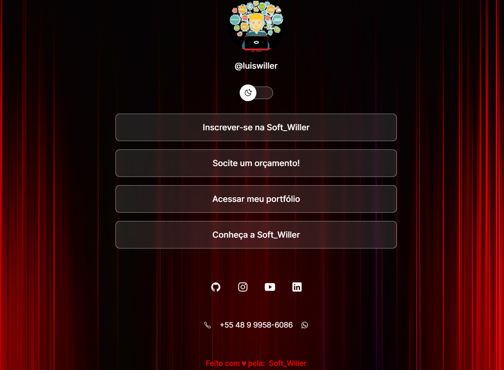

<h1 align="center"> Willer </h1>

  

## 🚀 Tecnologias

Esse projeto foi desenvolvido com as seguintes tecnologias:

- HTML e CSS
- JavaScript
- Git e Github
- Figma

## 💻 Projeto

Esse é um projeto em desenvolvimento por Luis Willer, em processo de aprendizagem, agregando conhecimento de várias escolas incluindo #rocketseat, #dslearn, #eucurso, entre outras.

O Willer é um louco fanático iniciante no mundo da programação.

- [Acesse o projeto em processo de desenvolvimento, online](https://github.com/luiswiller/luiswiller)

Feito com ♥ by Willer :wave: [Siga meu portfólio!](https://github.com/luiswiller)